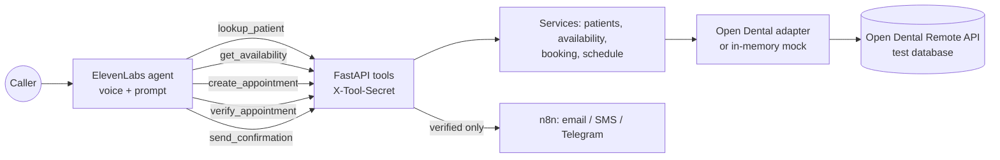

# Fairy Share Dental: an AI receptionist that never says "booked" until it's true

An AI voice receptionist for **Fairy Share Dental**, a fictional practice in Dallas, TX. It answers the phone, finds the patient, offers real open times, and books straight into the practice system, **Open Dental**. It only tells the caller they're booked after it has read the appointment back and checked that every field matches.

Built with **ElevenLabs Agents** (voice), a **FastAPI** tool layer (Python), the **Open Dental** Remote API and **n8n** (confirmations).

> **Status:** V1 is working. Live booking and read-back verification against Open Dental were confirmed on 2026-09-22, and confirmations go out by email, SMS or Telegram. Reschedule, cancel and human handoff are the next milestone.
>
> ⚠️ **Demo only.** It runs on Open Dental's developer test database with synthetic patients. It is **not HIPAA compliant**.

## Why

- **A booking agent that says "you're all set" is making a promise for the practice.** The save can fail, or the slot can be taken between the offer and the booking. The caller hangs up believing they have an appointment, and nobody finds out until the patient turns up.
- **The risk is a confident wrong answer, not an obviously wrong one.** Most of this design exists to stop the agent confirming a booking that didn't happen.
- **Patient data needs the smallest possible footprint:** the agent sees nothing it doesn't need, and the logs hold no health information.

## How it works



1. **Find the patient.** An exact match on name and date of birth returns a status and an opaque, signed `patient_ref`, never the patient's record number.
2. **Check.** `get_availability` returns up to 3 real open times. Each has a **signed `slot_id`** that expires after 15 minutes.
3. **Book.** `create_appointment` re-checks the slot, then saves the booking. It can only ever return `created_pending_verification`, never "booked".
4. **Verify.** `verify_appointment` reads the appointment back from Open Dental and compares every field. `verified: true` is the **only** state the prompt allows to be spoken as "booked".
5. **Confirm.** `send_confirmation` verifies again, then sends email, SMS or Telegram through n8n. It never sends for an unverified appointment.

**Design rules:**
- **The agent never talks to Open Dental directly.** Decisions happen in the services, not in the LLM or the adapter.
- **Signed references only.** The agent can't see patient or appointment numbers, and it can't invent or change a slot.
- **Minimum data to the agent:** a match status and the words to say. No record fields are read back.
- **No health information in logs:** only the tool name, conversation id and outcome.
- **Idempotent booking.** A retried booking finds the existing appointment instead of creating a second one.
- **Same interface, offline.** A mock of Open Dental sits behind the same adapter, so the whole flow runs and is tested without network access.

## Tools (ElevenLabs webhooks)

| Tool | Purpose |
|---|---|
| `lookup_patient` | Exact match on name + date of birth. Returns a status and an opaque `patient_ref` |
| `get_appointments` | Upcoming appointments for a verified patient |
| `get_availability` | Up to 3 real open times, each with a signed `slot_id` |
| `create_appointment` | Re-checks the slot, then books. Returns `created_pending_verification` (never "booked") |
| `verify_appointment` | Reads the appointment back from Open Dental. `verified: true` is the only confirmation |
| `send_confirmation` | Email, SMS or Telegram through n8n. Re-verifies first; never sent for unverified appointments |

## Repo layout

| Path | What it is |
|---|---|
| `backend/app/` | FastAPI app: `routers/tools.py`, `services/` (patients, availability, booking, schedule, notifications), `refs.py` (HMAC-signed references), `opendental/` (adapter and mock) |
| `backend/scripts/` | `check_opendental.py` (live check, optional write test), `seed_demo_patients.py`, `test_confirmation.py` |
| `config/` | `practice.yaml` (hours, providers, rooms) and `appointment_types.yaml` (durations, patterns) |
| `elevenlabs/` | `SYSTEM_PROMPT.md`, `TOOLS.md`, `KNOWLEDGE_BASE.md`, `SETUP.md`, `provision_agent.py` |
| `n8n/` | Confirmation workflow, keep-awake workflow, setup notes |
| `tests/` | `unit/`, `contract/` (full flow on the mock), `live/` (opt-in) |
| `docs/` | `ARCHITECTURE.md`, `OPEN_DENTAL_NOTES.md`, `TEST_SCRIPTS.md` |

## Setup

Python 3.12 with [uv](https://docs.astral.sh/uv/). Create the environment and install:

```bash
uv venv .venv --python 3.12
```
```bash
uv pip install -p .venv -r backend/requirements.txt
```
```bash
cp .env.example .env
```

In `.env`, `OD_MODE=mock` works offline. `OD_MODE=live` needs the Open Dental test keys from https://www.opendental.com/site/apisetup.html.

Run the tests:
```bash
.venv/bin/python -m pytest -q
```

Check the live connection. It's read-only; add `--write-test` to book and verify one synthetic appointment:
```bash
.venv/bin/python backend/scripts/check_opendental.py
```

Run the API:
```bash
.venv/bin/uvicorn app.main:create_app --factory --app-dir backend --port 8000
```

To set up the agent and its tools in ElevenLabs, see [elevenlabs/SETUP.md](elevenlabs/SETUP.md). For the confirmation workflow, see [n8n/README.md](n8n/README.md).

## Deployment

- **Hosted backend:** https://fairy-share-dental-2.onrender.com (Render free plan, Docker, deploys from `main`).
- **Secrets** live in Render's Environment tab, not in the repo. `render.yaml` marks them `sync: false`.
- **Free instances sleep** after about 15 minutes idle, so `n8n/fsd_keep_backend_awake.workflow.json` pings `/health` every 10 minutes.
- **Before a demo,** re-run `backend/scripts/seed_demo_patients.py`, because the Open Dental test database is wiped periodically.

## Verified

- ✅ **Live booking and read-back verification** against Open Dental, confirmed end to end on 2026-09-22.
- ✅ **Confirmations** by email, SMS or Telegram, sent through n8n only after verification.
- **43 tests:**
  - 20 unit tests
  - 22 contract tests that run the full booking flow on the mock
  - 1 opt-in live smoke test

## Next (V2)

`reschedule_appointment`, `cancel_appointment`, `human_handoff` and `urgent_call_escalation`.

## Notes

Fairy Share Dental is **fictional**. Patients are synthetic and the practice data is Open Dental's test database. This is a portfolio demonstration, not a medical or HIPAA-compliant system.
